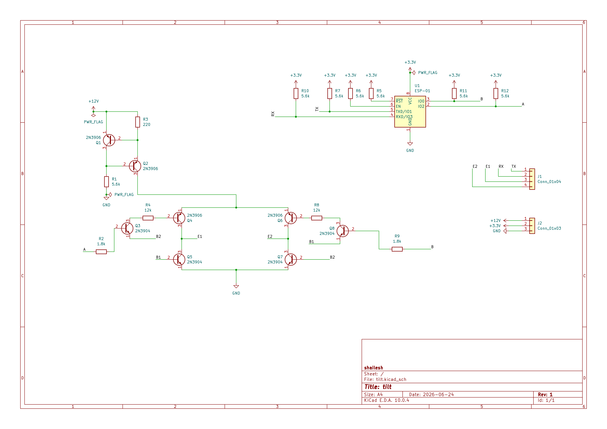
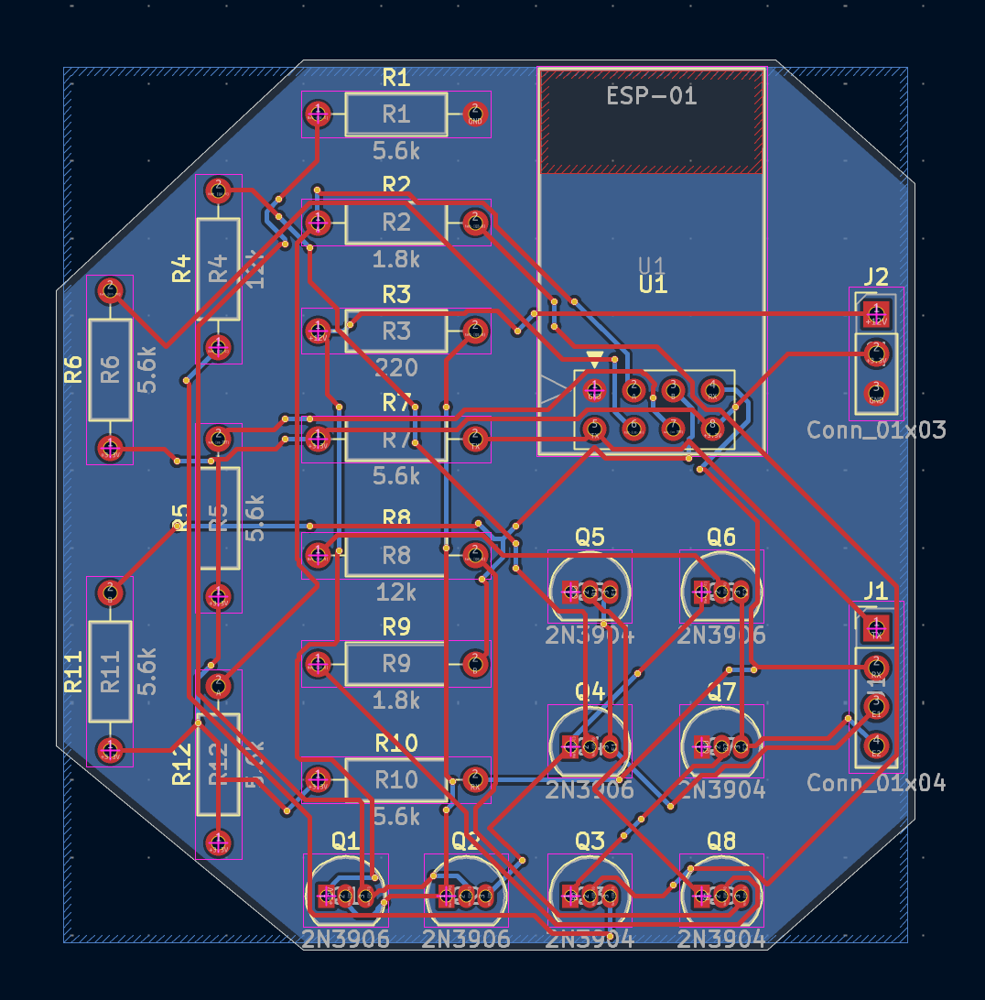
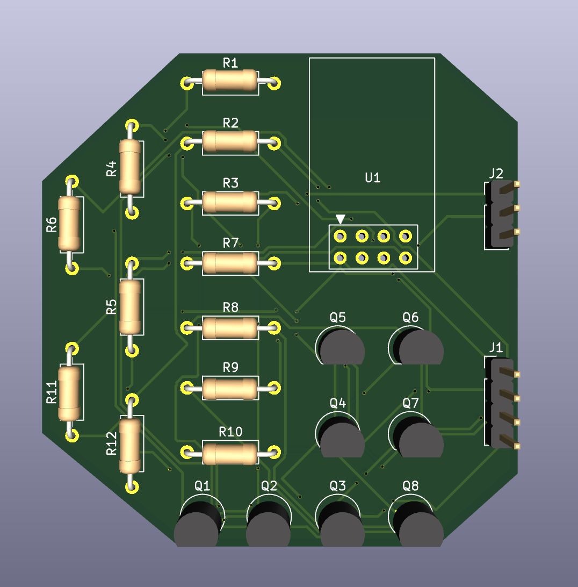

Galvanic Vestibular Stimulation (GVS)

custom galvanic vestibular stimulation device to control/hack your balance

## context

galvanic vestibular stimulation (gvs) delivers low-current dc signals (1-2 ma) across the mastoid processes to hack your balance. the cathode depolarizes the vestibular nerves to increase their firing rate, while the anode hyperpolarizes them to decrease it. your brain perceives this mismatch as physical tilt, forcing your body to instinctively lean toward the anode to compensate.

## schematic

1. control (esp-01)
   generates complementary pwm and direction signals. gpio0 and gpio2 need pull-up/pull-down resistors to force a known safe state during bootup so they don't float and trigger the stimulation rail on power-up

2. power boost (mt3608)
   steps up 3.7v input to a stable 12v-15v rail. this high headroom is required to break through skin-electrode impedance, which easily sits around 5k-10k ohms on dry skin

3. galvanic isolation
   optoisolators decouple the microcontroller's logic from the stimulation stage. this shields your head from any potential mains-side faults or grounding issues if you ever plug the esp-01 into a usb port to debug

4. active constant-current regulation
   the critical safety gate. uses an lm334 or a closed-loop feedback op-amp to clamp the current to a strict 1.5ma-2ma. this overrides the dynamic drop in skin resistance so you don't get a sudden, uncontrolled current spike

5. h-bridge polarity control
   uses a matched array of 2n3906 (pnp) and 2n3904 (npn) transistors. dynamically reverses the current path across the electrode array, swapping which mastoid acts as the cathode and which acts as the anode for left/right tilt

## pcb

i just wanted a non rectangular shaped pcb so i just made it into a random polygon

